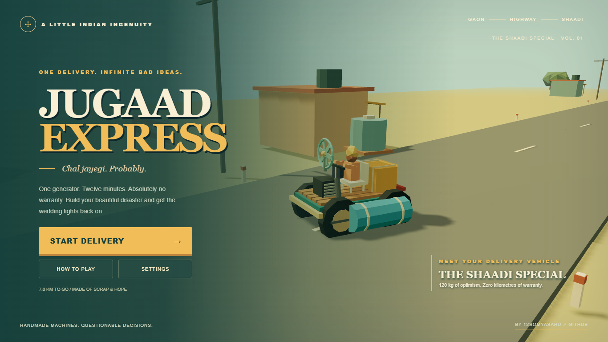

# Jugaad Express

**One generator. Twelve minutes. Absolutely no warranty.**

A playable 3D arcade driving game about delivering a generator to an Indian wedding during a power outage. Build an increasingly questionable vehicle from roadside scrap. Every upgrade solves a problem and introduces a tradeoff.

Created by **[12somyasahu](https://github.com/12somyasahu)**.



## Play from this folder on Windows

1. Install **Node.js 22.12 or newer** from [nodejs.org](https://nodejs.org/). Node includes npm. Reopen your terminal after installation.
2. Open File Explorer and go to `D:\Gamathon\Jugaad Express`.
3. Click the address bar, type `powershell`, and press Enter. Alternatively, open a terminal and run:

   ```powershell
   cd "D:\Gamathon\Jugaad Express"
   ```

4. Install the dependencies the first time:

   ```powershell
   npm.cmd install
   ```

5. Start the game server:

   ```powershell
   npm.cmd run dev
   ```

6. The terminal prints a **Local** address, normally `http://127.0.0.1:5173/`. Open the exact address it prints in Chrome or Edge. If a port is occupied, Vite automatically chooses another port.
7. Click **START DELIVERY**. Keep the terminal open while playing. Press **Ctrl+C** in that terminal when you want to stop the server.

On later visits, repeat steps 2, 5, and 6. You only need to install dependencies again after a dependency update or after deleting `node_modules`.

**Do not double-click `index.html` or `dist/index.html`.** Browser module imports need a local HTTP server. The game does not require a backend, account, database, API key, or paid service. Internet access is required for the initial dependency installation; the installed game then runs locally without network assets.

`npm.cmd` avoids Windows PowerShell's `npm.ps1 cannot be loaded` execution-policy error. In Command Prompt, macOS, or Linux, plain `npm` works too:

```sh
npm install
npm run dev
```

## Get a fresh copy from GitHub

With Git installed:

```sh
git clone https://github.com/12somyasahu/jugaad-express.git
cd jugaad-express
npm install
npm run dev
```

Without Git: open the repository, choose **Code → Download ZIP**, extract the ZIP into a normal folder, open a terminal **inside the extracted folder containing `package.json`**, then run `npm install` and `npm run dev`. Do not run the game directly from inside the ZIP.

## Controls

| Key | Action |
| --- | --- |
| W / Up | Accelerate |
| S / Down | Brake, then reverse |
| A / D or Left / Right | Steer |
| Space | Handbrake |
| E | Collect nearby scrap, visit a mechanic, or use a shortcut |
| Tab | Open / close the Jugaad workshop |
| F | Emergency repair while stopped |
| R | Recover to the road; adds 8 seconds |
| Esc | Pause / close an overlay |
| Right mouse button + drag | Look around |
| Sound button | Mute / unmute |

Desktop keyboard required. Recommended display: 1366 × 768 or larger. A WebGL 2-capable Chrome or Edge browser with hardware acceleration is required.

## Your first delivery

- Drive out of the village. The first crate and overheated engine introduce the vehicle's personality.
- Chacha gives you a water bottle, fan, and pipe. Press **Tab**, choose a part and mounting position, then **LAGAO JUGAAD**.
- Glowing scrap piles sit beside the road. Approach and press **E**. Collect fuel cans and use them in the workshop.
- Fans cool the engine but consume battery power. Passive pipes and radiators are heavier. A roof tank makes the vehicle lean. Tractor wheels improve grip but add weight. A second engine burns more fuel and creates heat.
- Up to six persistent parts can be fitted. Replacing an occupied slot returns its old part to inventory. Click an installed part to remove it. Wheel upgrades use the Wheels slot; other parts can be mounted creatively.
- Roadside **CHACHA 2.0** checkpoints offer one free full service and a mystery part, costing 20 seconds. Trade an unwanted scrap for fuel if needed.
- Mud shortcuts need grip. Water shortcuts need flotation. Ramp shortcuts need 65 km/h and a vehicle under 190 kg. A successful shortcut advances you 240 metres and costs 5 seconds.
- Attachments have durability. Crashes can make them shake and fall off. Rope protects attachments; armour protects the engine.
- If the engine is wrecked or fuel runs out, stop and press **F**. Emergency repairs restore enough resources to continue; they add 10 seconds, take a short repair animation, and have a cooldown.
- Reach the wedding at the end of the 7.6 km route. The generator connects, the lights come on, and the score is revealed.

The five stages are **Gaon → Broken Road → Highway → Monsoon → Hill Road**. The 12-minute deadline is soft: when the baraat arrives, you can keep playing with a score penalty. The workshop slows gameplay to 15%; Escape pauses it fully. Best time, best rating, quality, and audio preferences save in this browser's local storage. Active runs do not resume after a page reload.

## Production build

```sh
npm run build
npm run preview
```

Open the preview address printed in the terminal (normally `http://127.0.0.1:4173/`). The build is in `dist/`. To share a static build, upload the **contents of `dist`** to a static web host. Relative asset URLs allow hosting under a repository subdirectory.

## Tests

```sh
npm test
npm run build
npx playwright install chromium
npm run test:browser
```

If Chrome is already installed on Windows, the browser download is optional:

```powershell
$env:PLAYWRIGHT_CHANNEL = "chrome"
npm.cmd run test:browser
```

The unit tests cover part tradeoffs, battery-dependent cooling, armour, attachment damage, route stages, and achievable scoring. Browser tests exercise driving, collisions, scrap collection, installation, reverse, steering, repair, pause, restart, shortcuts, service, breakage, late delivery, ending, settings, and local saves. They use development-only hooks to advance the simulation and reach later stages quickly; these hooks are removed from production builds.

## Troubleshooting

| Problem | Fix |
| --- | --- |
| `npm` is not recognized | Install Node.js, then close and reopen the terminal. |
| PowerShell blocks `npm.ps1` | Use `npm.cmd` as shown above. No execution-policy changes needed. |
| `package.json` not found | Run the command from the extracted game folder, not its parent. |
| Browser says connection refused | Start `npm run dev`, keep the terminal open, and use its exact Local URL. |
| Port 5173 is busy | Use the alternate address Vite prints. |
| Blank screen / WebGL error | Enable browser hardware acceleration, update the browser and graphics driver, then reload. |
| Low frame rate | Open Settings and choose Low graphics; close other GPU-heavy tabs. |
| No audio | Click Start first (browser audio needs interaction), then check the Sound toggle. |
| Stuck / damaged / no fuel | R recovers the vehicle; stop and press F for emergency repair. |
| Changes not visible | Reload the page; rebuild `dist` if using production preview. |

## Project files

```text
index.html                 Browser entry
src/main.js                Driving, UI, journey, camera, events, ending
src/world.js               Procedural environment, vehicle, attachments, particles
src/systems.js             Parts, stats, damage, route and scoring
src/audio.js               Procedural Web Audio effects and music
src/style.css              Menu, HUD, workshop and responsive layouts
tests/systems.test.js      Gameplay-system tests
tests/browser/game.spec.js Browser integration tests
vite.config.js             Relative production paths and Three.js bundle
```

All in-game models, effects, textures, and audio are generated in code. The game uses [Three.js](https://threejs.org/docs/) and Vite. No external art, font, model, or audio downloads are required at runtime.

## Update your public repository

After editing and checking the game:

```sh
npm test
npm run build
git add src tests index.html package.json package-lock.json README.md vite.config.js playwright.config.js .gitignore
git commit -m "Describe your game update"
git push origin main
```

`node_modules`, generated builds, secrets, logs, and browser-test output are excluded by `.gitignore`. Anyone cloning the public repository installs dependencies locally.

---

**Made by [12somyasahu — visit my GitHub profile](https://github.com/12somyasahu).**
